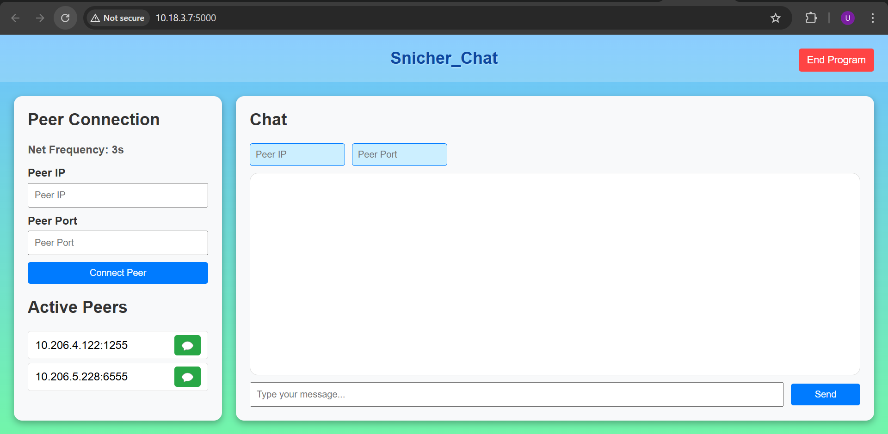

# Snicher Chat – A P2P Chat Application with Flask Web Interface(Include BONUS)

## Overview
Snicher Chat is a peer-to-peer (P2P) chat application **incluing bonus question**written in Python by TEAM-SNITCHER. It allows multiple peers to connect and exchange messages in real-time. This repository contains two main components:

1. **A P2P console-based script** (`P2P_Chat_Snicher.py`) for handling direct socket connections between peers.
2. **A Flask-based web application** (`app.py`) that provides a user-friendly interface for connecting to peers, sending messages, and viewing active peers.
# Team_Detail
**Team_Name: Snitcher**
## Team-Members
1. Utkarsh Singh     230041035
2. Srujan Patel      230001063
3. Rohan Sinha       230041030

## Features
1. **Peer-to-Peer Messaging**  
   - Direct socket connections between peers using Python’s `socket` and `threading` libraries.
   - Each peer listens on a specific port and can accept incoming connections.

2. **Automatic Peer Discovery and Management**  
   - When a new connection is established, the application updates its list of active peers.
   - Ability to handle multiple connections concurrently through multithreading.

3. **Flask Web Interface**  
   - A simple, clean UI built with Flask, HTML, and CSS.
   - View and manage active peers in real-time.
   - Send and receive messages within a browser interface.

4. **Console-based Menu**  
   - Text-based menu to send messages, connect to new peers, and query the active peer list.
   - Ability to gracefully exit, which closes all connections.

5. **Mandatory Message Broadcast**  
   - On startup, the console application sends a “mandatory message” to two predefined IP/Port combinations.
    ```bash
   – IP: 10.206.4.122, PORT: 1255
   – IP: 10.206.5.228, PORT: 6555
   ```


## Technologies Used
- **Python 3**: Core language for the P2P script.
- **Socket Programming**: For creating and managing peer-to-peer connections.
- **Threading**: Allows the application to handle multiple peer connections simultaneously.
- **Flask**: Provides a lightweight web framework to build the web-based UI.
- **HTML/CSS**: For structuring and styling the web application.

## Project Structure

```
.
├── snicher_chat.py       # Main P2P script for console-based operations
├── app.py                # complete Flask web application (including HTML,CSS in it)
├── Images                # Web interface Preview images
└── README.md             # This file
```

### `snicher_chat.py` (Console P2P Application)
- **Imports & Globals**  
  - Uses `socket`, `threading`, `sys`, `time` for P2P functionality.
  - Maintains a dictionary of active peers (`active_peers`) and a lock (`peers_lock`) to ensure thread-safe operations.
- **`get_local_ip()`**  
  - Determines the local IP address (by connecting to a known address like 8.8.8.8).
- **`handle_client(conn, addr)`**  
  - Dedicated thread function to handle incoming messages from a peer.
  - Processes special messages such as `CONNECT:<port>` and `exit`.
- **`server_thread(listen_socket)`**  
  - Listens for incoming connections and spawns `handle_client` threads.
- **`send_message(target_ip, target_port, message)`**  
  - Sends a message to a specified peer. Establishes a new connection if none exists.
- **`connect_to_peer(target_ip, target_port)`**  
  - Sends a `CONNECT:<my_listen_port>` message to the specified peer.
- **`query_active_peers()`**  
  - Prints out the list of currently active peers.
- **`send_mandatory_messages()`**  
  - Sends a default “Hello from our peer!” message to two predefined IP/Port pairs.
- **`main()`**  
  - Entry point of the console application.  
  - Asks for team name and listening port.  
  - Binds the server socket, starts the listening thread, and sends mandatory messages.  
  - Displays a menu for sending messages, querying peers, and connecting to peers.

### `app.py` (Flask Web Application)
- **Imports & Setup**  
  - Uses `Flask` to create a web server and handle routes.
  - May include additional libraries or modules for socket management (depending on your implementation).
- **Routes**  
  - **`/`**: Renders the main chat interface with forms to connect to peers, send messages, and display active peers.
  - **Additional Routes**: For sending messages, updating peer lists, or handling real-time communication (if implemented with websockets or long polling).



## Getting Started

### Prerequisites
- **Python 3.7+** (recommended)
- **pip** package manager
- **Flask** (if you plan to use the web interface)

### Installation
1. **Clone the repository**:
   ```bash
   git clone https://github.com/yourusername/snicher_chat.git
   cd snicher_chat
   ```
2. **(Optional) Create and activate a virtual environment**:
   ```bash
   python3 -m venv venv
   source venv/bin/activate   # On Windows: venv\Scripts\activate
   ```
3. **Install dependencies**:
   ```bash
   pip install flask
   ```

### Running the Console Application
1. Navigate to the project directory.
2. Run the script:
   ```bash
   python P2P_Chat_Snicher.py
   ```
3. Follow the prompts:
   - Enter your **team name**.
   - Enter your **listening port** (e.g., `5000`).
4. The application will:
   - Display your local IP.
   - Start listening on the specified port.
   - Attempt to send mandatory messages to the predefined peers.
5. You will see a menu with the following options:
   - **1. Send message**: Prompts for IP, port, and the message to send.
   - **2. Query active peers**: Shows a list of connected peers.
   - **3. Connect to a peer**: Prompts for IP and port, then sends a `CONNECT:<port>` message to the peer.
   - **0. Quit**: Shuts down the server and closes all connections.

### Running the Flask Web Application
1. Navigate to the project directory (if not already there).
2. Run the Flask app:
   ```bash
   python app.py
   ```
3. By default, Flask runs on `http://127.0.0.1:5000` (or the port you specify).
4. Access the application in your browser:
   ```
   http://127.0.0.1:5000
   ```
5. Use the web UI to:
   - **Connect to a peer** by entering their IP and port.
   - **View Active Peers** and their status.
   - **Send Messages** in the chat window.

## How It Works
1. **Startup**  
   - A TCP server socket is bound to your chosen port.
   - The server listens for new connections and spawns a thread for each client.
2. **Peer Discovery**  
   - On connecting to a peer, a `CONNECT:<port>` message is sent, letting the remote peer update its record of your listening port.
3. **Messaging**  
   - Messages are sent via TCP sockets. Each peer runs a listener to receive messages.
   - If a new message is sent to a peer not yet in the `active_peers` dictionary, the script automatically attempts to establish a connection.
4. **Exiting**  
   - Peers can send an `exit` command to gracefully disconnect.
   - Closing the main application shuts down all sockets and threads.

## Notes and Best Practices
- Ensure your firewall settings allow incoming connections on the port you choose.
- Use valid IP addresses and ports when connecting to peers.
- If you need encryption, consider using an SSL/TLS wrapper or other secure channels. Currently, this application sends data in plain text.

## Troubleshooting
- **Port Already in Use**: If you see an error about the port being in use, pick a different port or terminate the process using that port.
- **Connection Refused**: Verify the target peer is running and listening on the specified IP and port.
- **Timeouts**: Network latency or firewall issues can cause timeouts. Check your connection settings.

## License
This project is provided as-is without any specific license. You are free to modify or integrate it into your own projects. If you plan to open-source or distribute it, please include appropriate credits or apply a license of your choice.

---

Feel free to customize this README to suit your exact setup, environment, or additional features. Happy chatting!
